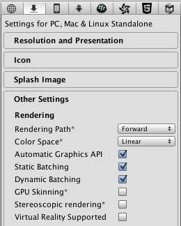
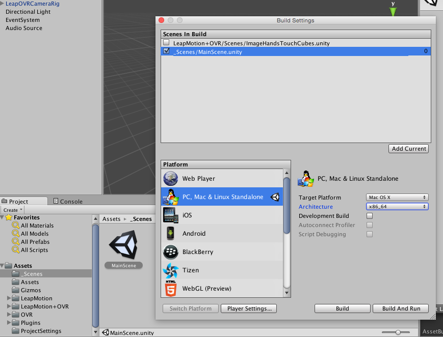
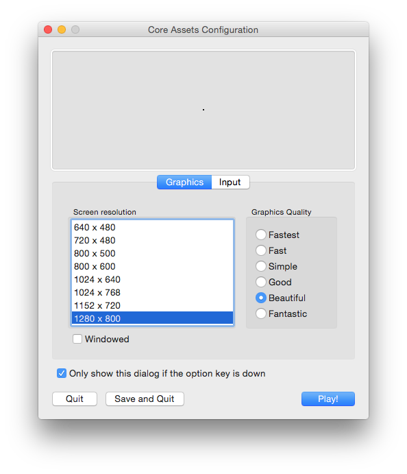

# Sushi :sushi: [](https://waffle.io/Sushisushi-sandesu/sushi)

:snowman: :star2: :tada: :christmas_tree: :christmas_tree: :christmas_tree: :tada: :star2: :snowman:

## Usage

### 1. Set up environment

1. Download and install **Unity 5.1.2 for Mac** at [Unity Downloads](http://unity3d.com/get-unity/download/archive).
2. Go to [Oculus Developer Downloads](https://developer.oculus.com/downloads/). Download and install  
    - For Runtime, download **Oculus Runtime for OS X V0.5.0.1-beta** [here](https://developer.oculus.com/downloads/pc/0.5.0.1-beta/Oculus_Runtime_for_OS_X/);
    - For SDK, download **Oculus SDK for OS X 0.5.0.1-beta** [here](https://developer.oculus.com/downloads/pc/0.5.0.1-beta/Oculus_SDK_for_OS_X/);
    - Now we don't need to download "Engine Integration" since Leap Motion SDK comes with one.
3. Download and install [**Leap Motion SDK for OSX**](https://developer.leapmotion.com/)
4. Install Unity, Oculus SDK and Runtime.

### 2. Prepare to hack this repository

1. Clone this repository
  ```
  $ git clone git@github.com:Sushisushi-sandesu/sushi.git
  $ cd sushi
  ```
6. Open Unity. At the welcome window, click **"Open Other"**.
7. Switch to the cloned projects directory, then click **"open"**.
8. Now, since the Leap Motion's assets are excluded from the repo, we need to download the assets. Go to **"Asset Store"**, search for **"Leap Motion Core Assets"**, then click **"import"**. When asked to update the APIs, click **"I made a backup. Go ahead"**.
9. Now the project should be able to build.

### 3. Build and run the project

According to the [Leap Motion site](https://developer.leapmotion.com/downloads/unity), one of the requirements for using the Core Assets on OSX is that the Integrated VR Support must be **turned off**. To turn off the integrated VR support:

1. Open Unity.
2. Go to Edit -> Project Settings -> Player.
3. Make sure the **Virtual Reality supported** checkbox is ***unchecked***.



As a result of Leap Motion Core Assets importing, asset files under *ProjectSettings* will be overwritten by binary files. This is harmful to git file management, so we need to re-convert them into text files:

1. Go to Edit -> Project Settings -> Editor.
2. Select **"Force Text"** from a select box of **Asset Serialization**.

Now, since the integrated VR support must be turned off, it is not possible to build and preview the VR app inside Unity. Therefore, building a standalone executable is necessary every time we want to try out the app. To build a standalone executable:

1. Open Unity, go to the project we are building.
2. Go to File -> Build Settings.
3. Uncheck a default selected scene. 
4. Add and check the scenes to be built. (Usually selecting the scene from *Assets/_Scenes* and pushing **"Add current"** would suffice)
5. Choose the **"Target Platform"** as **"OSX"**. Choose the **"Architecture"** according to your computer's spec. Otherwise the app will appear to be a total blank.
6. Click **Player Settings** and make sure the **Virtual Reality supported** checkbox is ***unchecked***.
7. Click **"Build"** and choose the path you want to place the executable.



Here, connect Leap Motion and run Leap Motion Controller app.

Finally, run the executable by double-clicking with pushing <kbd>Option</kbd> key. And you will see Core Assets Configuration window. In this window, Graphics Quality should be set **Beautiful** or **Fantastic**. (if launched app just has white screen, try another quality option)



## References

- [Using Git with Unity](http://unity3diy.blogspot.jp/2014/06/using-git-with-3d-games-source-control_8.html)